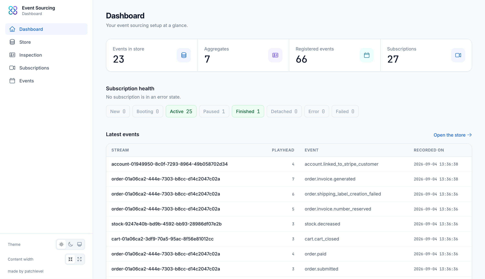

# Dashboard

The dashboard view is the landing page of the bundle. It gives you an overview of your event
sourcing setup at a glance, before you drill down into the store, a single aggregate or your
subscriptions. The index route of the bundle redirects here.

## Overview

Four cards summarize the current state of your system:

* **Events in store**: how many messages your event store holds in total
* **Aggregates**: how many aggregate roots are registered
* **Registered events**: how many event classes are registered
* **Subscriptions**: how many subscriptions the subscription engine knows about

Each card links to the view where you can explore that number in detail.

## Subscription health

Below the cards you see how your subscriptions are distributed across the statuses of the
subscription engine, for example `active`, `booting`, `paused` or `error`. Statuses without any
subscription are hidden, so in a healthy system you only see `active`.

Every status is a link into the [subscriptions](subscriptions.md) view, pre-filtered to that
status. This makes the dashboard a good starting point when something goes wrong: a red `error`
or `failed` pill takes you straight to the subscriptions that need attention.

:::tip
If you only ever want to look at one thing, look at this row. Everything else on the page is
informational, but a non-empty `error` or `failed` count means events are not being processed.
:::

## Latest events

The last recorded events are listed at the bottom, newest first, with the same columns as the
[store](store.md) view. From here you can jump into the inspection of the aggregate or stream
that recorded an event, or open the full store listing.

## Learn more

* [How to browse and filter the event store](store.md)
* [How to inspect a single aggregate](inspection.md)
* [How to manage subscriptions](subscriptions.md)
